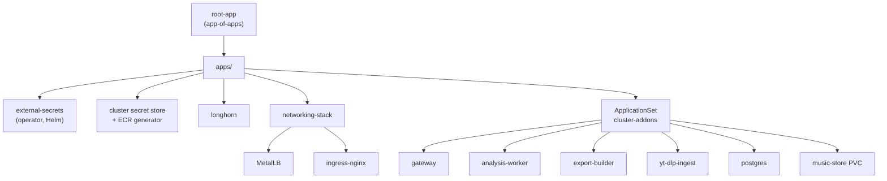
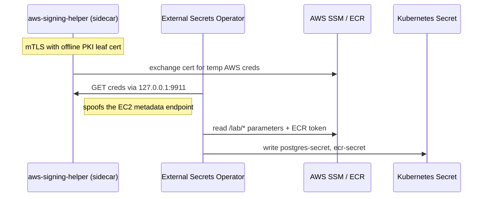

# bvault-manifests

The desired state of everything running inside the BeatVault Kubernetes cluster. ArgoCD
watches this repository and continuously reconciles the cluster to match it — this repo is
the only supported way to change what runs in production. Nothing is applied by hand.

The cluster itself is built by [bvault-infra](https://github.com/xilver1/bvault-infra); the
container images come from [bvault-app](https://github.com/xilver1/bvault-app). This repo is
the seam where they meet.

---

## How it syncs

ArgoCD is bootstrapped in **core mode** with an *app-of-apps* pattern. A single `root-app`
points at `apps/` and recurses, so every Application defined there is adopted automatically.
Cluster add-ons under `builder/workloads/` are onboarded by an **ApplicationSet** with a Git
directory generator — dropping a new folder there is enough to create a new self-managing
Application.



### Ordering with sync-waves

Bootstrapping has a strict dependency order, expressed with `argocd.argoproj.io/sync-wave`
annotations so ArgoCD applies things in the right sequence on a cold cluster:

| Wave | Resource | Why |
|------|----------|-----|
| `-2` | External Secrets Operator | Must exist before any store or secret |
| `-1` | `ClusterSecretStore` + `ECRAuthorizationToken` | Provider config for secrets |
| `0` | `ExternalSecret`s (Postgres, ECR pull secret) | Populate real secrets |
| `5` | MetalLB `IPAddressPool` | After the controller is up |

---

## Secrets without secrets

No credentials are stored in this repository. Runtime pods obtain AWS credentials through
**IAM Roles Anywhere**, and the External Secrets Operator projects SSM parameters into
native Kubernetes secrets.



The signing-helper runs as a sidecar to the ESO controller. ESO is pointed at it via
`AWS_EC2_METADATA_SERVICE_ENDPOINT=http://127.0.0.1:9911/`, so it believes it is running on
an EC2 instance and picks up short-lived credentials transparently. From there:

- A `ClusterSecretStore` reads `/lab/*` parameters and materialises the Postgres
  connection secret (username, password, and an assembled `DATABASE_URL`).
- An `ECRAuthorizationToken` generator mints a registry token, templated into a
  `dockerconfigjson` pull secret that is attached to the namespace's default ServiceAccount —
  so every pod pulls from private ECR without any per-pod configuration.

---

## Workloads

Everything runs in the `bvault-prod` namespace unless noted.

| Workload | Kind | Notes |
|----------|------|-------|
| `gateway` | Deployment | HTTP API, owns the Postgres schema, mounts the music store |
| `analysis-worker` | Deployment (×2) | Horizontally scalable BPM/waveform analysis |
| `export-builder` | Deployment + Service | Builds rekordbox USB layouts on request |
| `yt-dlp-ingest` | Deployment | Python ingest service for external sources |
| `postgres` | StatefulSet | `postgres:16-alpine` on a 10Gi Longhorn volume |
| `music-store` | PVC | Shared audio + artifact storage (NFS-backed) |

Ingress is fronted by ingress-nginx on a MetalLB LAP address (`192.168.0.200.nip.io`), with
`proxy-body-size` raised to 200 MiB so audio uploads reach the gateway instead of being
rejected at the proxy. `/exports` routes to `export-builder`; everything else to `gateway`.

Pods run as a non-root user (UID 1001) matching the ownership set on the NFS export, and
Postgres pins `PGDATA` to a `pgdata` subdirectory so it never trips over `lost+found` on a
fresh Longhorn volume.

---

## How images get here

Images are built and pushed to ECR by the workflows in
[bvault-app](https://github.com/xilver1/bvault-app), tagged immutably with the git SHA.
Kustomize then pins each workload to an exact image digest via an `images:` override:

```yaml
images:
  - name: gateway-image
    newName: 854469103070.dkr.ecr.us-east-1.amazonaws.com/bvault_app
    newTag: gateway-4c91cba45d1345dc4faa1caea6494c4f2ba887fa
```

Bumping the tag in the relevant `kustomization.yaml` and committing is what triggers a
rollout — the deploy is a git commit, and ArgoCD does the rest.

---

## Repository layout

```
bvault-manifests/
├── apps/                         # app-of-apps: what ArgoCD adopts
│   ├── git-generator.yaml        # ApplicationSet for builder/workloads/*
│   ├── eso-producer/             # External Secrets Operator (Helm) + CRDs
│   ├── eso-consumer/             # ClusterSecretStore, ExternalSecrets, ECR generator
│   ├── longhorn/                 # distributed block storage
│   ├── networking.yaml           # points at networking/
│   └── velero/                   # cluster backup (in progress)
├── builder/workloads/            # the BeatVault application stack
│   ├── gateway/  analysis-worker/  export-builder/  yt-dlp-ingest/
│   ├── postgres/  music-store/
└── networking/
    ├── metallb/                  # L2 pool 192.168.0.200-210
    └── ingress-nginx/
```